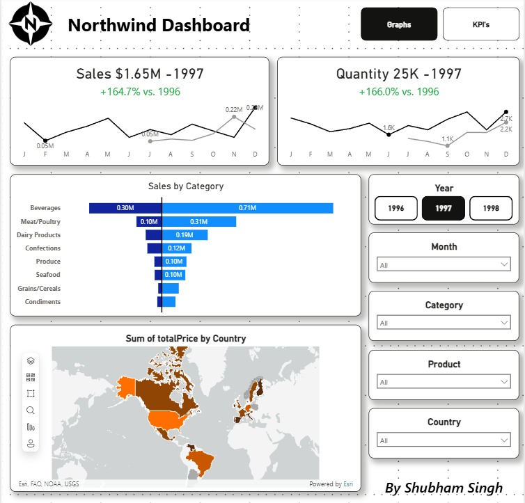
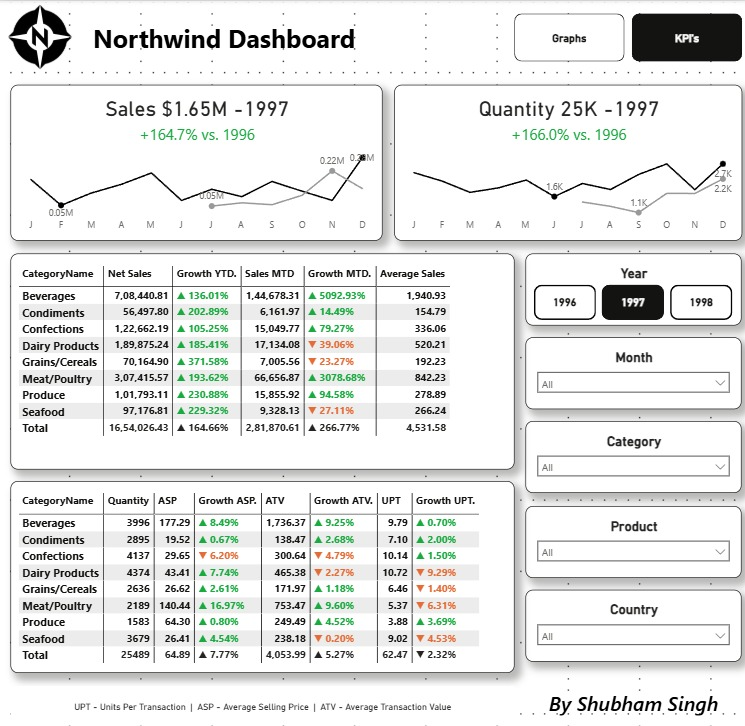

# Northwind PowerBI Dashboard

This repository contains a PowerBI dashboard built using the classic Northwind dataset. The dashboard provides interactive visualizations and insights into sales, customers, products, and employee performance.

## Features

- Sales analysis by region, product, and time period
- KPIs for sales growth | "UPT - Units Per Transaction  |  ASP - Average Selling Price  |  ATV - Average Transaction Value"


## Folder Structure

```
northwind/
├── data/
│   ├── csv/              # Northwind dataset (CSV format)
│   ├── SQL
│       └── northwind-sqlServer.sql # Northwind dataset (MS SQL Server format)
        └── northwind-mysql.sql    # Northwind dataset (MySQL format)
├── dashboard.pbix          # PowerBI dashboard files (.pbix)
├── screenshots/         # Dashboard screenshots
├── logo/                # Dashboard logo
├── readme.md            # Project documentation
└── LICENSE              # License information
```

## Screenshots

Below are sample screenshots of the PowerBI dashboard:



*Sales analysis by region and product and time.*



*Key Performance Indicators (KPIs) for sales growth.*

## Getting Started

1. Clone this repository.
2. Open the `.pbix` file in PowerBI Desktop.
3. Connect to the Northwind data source (included or specify your own).
4. Refresh data and explore the dashboard.

## Data Source

The dashboard uses the Northwind sample database, a widely used dataset for demonstrating business analytics.

## Requirements

- PowerBI Desktop (latest version recommended)
- Access to Northwind database (SQL, CSV, or Excel format)

## License

This project is licensed under the MIT License.

## Contact
**Contact Me**

- **Email:** 29chauhanjoyti03@gmail.com
- **Phone:** +91-6283164294
- **LinkedIn:** 
- **GitHub:** [github.com/joyti29](https://github.com/joyti29)

For questions or feedback, please open an issue in this repository.
